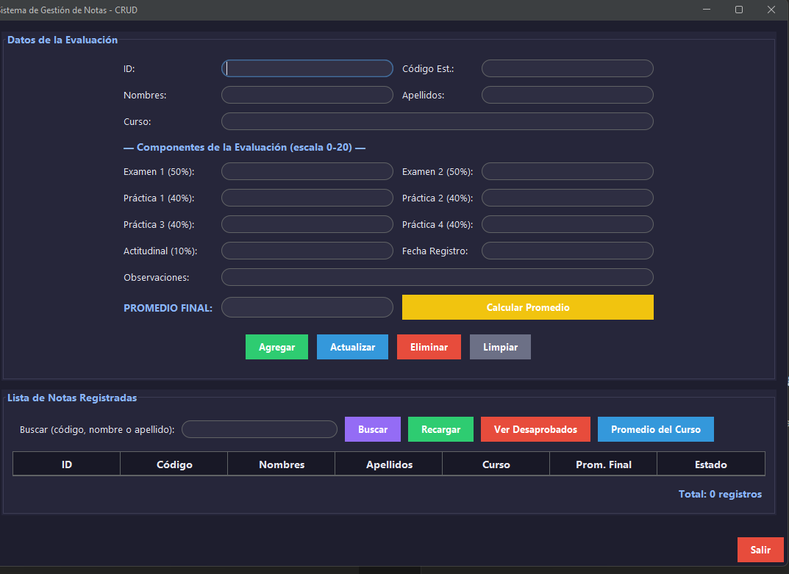

# 📚 Sistema de Gestión de Notas

Sistema de escritorio para gestionar las evaluaciones de un curso universitario, desarrollado en **Java (Swing)** con el patrón **MVC** y base de datos **MySQL**. Calcula automáticamente el **promedio final ponderado** de cada estudiante a partir de sus componentes de evaluación.




---

## ✨ Características

- Interfaz gráfica moderna con **tema oscuro** ([FlatLaf](https://www.formdev.com/flatlaf/))
- Patrón de diseño **MVC** (Modelo–Vista–Controlador)
- Operaciones CRUD completas (Crear, Leer, Actualizar, Eliminar lógico)
- **Cálculo automático del promedio final ponderado** de cada estudiante
- Botón para calcular y previsualizar el promedio antes de guardar
- Reporte de estudiantes **desaprobados**
- Reporte de **promedio general** por curso
- Búsqueda por código, nombre o apellido
- Credenciales de base de datos protegidas con variables de entorno (`.env`)

---

## 🧮 Fórmula de evaluación

El promedio final se calcula sobre una escala vigesimal (0 a 20):

| Componente | Cálculo | Peso |
|---|---|---|
| Promedio de Exámenes | (Examen 1 + Examen 2) / 2 | **50%** |
| Promedio de Prácticas | (Práctica 1+2+3+4) / 4 | **40%** |
| Nota Actitudinal | Valor directo | **10%** |

```
Promedio Final = (Prom. Exámenes × 0.50) + (Prom. Prácticas × 0.40) + (Actitudinal × 0.10)
```

Un estudiante se considera **Aprobado** con un promedio final ≥ 10.5.

---

## 🛠️ Tecnologías

| Tecnología | Uso |
|---|---|
| Java 17+ (OpenJDK) | Lenguaje del proyecto |
| Java Swing | Interfaz gráfica de escritorio |
| [FlatLaf](https://www.formdev.com/flatlaf/) | Tema oscuro moderno para Swing |
| MySQL | Base de datos relacional |
| JDBC | Conexión Java ↔ MySQL |
| Maven | Gestión de dependencias y build |
| [java-dotenv](https://github.com/cdimascio/java-dotenv) | Carga de credenciales desde `.env` |
| IntelliJ IDEA | Entorno de desarrollo |

---

## 📁 Estructura del proyecto

```
GestionNotasGUI
├── sql/
│   └── gestion_notas.sql          # Script de creación de la base de datos
├── src/main/java
│   ├── model/
│   │   ├── ConexionBD.java        # Conexión JDBC (lee credenciales del .env)
│   │   ├── Nota.java              # Entidad + cálculo del promedio ponderado
│   │   └── dao/
│   │       └── NotaDAO.java       # Acceso a datos (CRUD + reportes)
│   ├── controller/
│   │   └── NotaController.java    # Validaciones y lógica de negocio
│   └── view/
│       └── VentanaPrincipal.java  # Interfaz gráfica (Swing + FlatLaf)
├── .env.example                    # Plantilla de variables de entorno
├── .gitignore
└── pom.xml
```

---

## 🚀 Instalación y ejecución

### 1. Clonar el repositorio

```bash
git clone https://github.com/krayztx/GestionNotasGUI.git
cd GestionNotasGUI
```

### 2. Crear la base de datos

Ejecuta el script `sql/gestion_notas.sql` en MySQL Workbench o en la consola de MySQL:

```bash
mysql -u root -p < sql/gestion_notas.sql
```

### 3. Configurar las credenciales

Copia la plantilla y complétala con tus propios datos:

```bash
cp .env.example .env
```

Edita el archivo `.env` recién creado:

```
DB_URL=jdbc:mysql://localhost:3306/gestion_notas
DB_USER=root
DB_PASSWORD=tu_contraseña_aqui
```

> ⚠️ El archivo `.env` está en `.gitignore` y nunca se sube al repositorio — cada persona que clone el proyecto debe crear el suyo con sus propias credenciales.

### 4. Abrir en IntelliJ IDEA

1. **File → Open** y selecciona la carpeta del proyecto
2. Espera a que Maven descargue las dependencias automáticamente (o hazlo manualmente con el ícono de Maven → **Reload All Maven Projects**)

### 5. Ejecutar

Abre `src/main/java/view/VentanaPrincipal.java` y ejecuta el método `main()` (▶️).

---

## 📖 Guía de uso

1. **Registrar una evaluación:** completa el código del estudiante, nombres, apellidos, curso, los 7 componentes de nota y la fecha
2. **Calcular Promedio:** previsualiza el resultado antes de guardar (se colorea verde si aprueba, rojo si no)
3. **Agregar / Actualizar / Eliminar:** operaciones estándar del CRUD sobre la tabla
4. **Ver Desaprobados:** filtra la lista mostrando solo promedios menores a 10.5
5. **Promedio del Curso:** calcula el promedio general de todos los estudiantes de un curso

---

## 🔒 Seguridad

Las credenciales de la base de datos **no están escritas en el código fuente**. Se cargan en tiempo de ejecución desde un archivo `.env` local (excluido del control de versiones mediante `.gitignore`), siguiendo la misma práctica que se usa en proyectos profesionales para evitar exponer contraseñas en repositorios públicos.

---

## 🎓 Contexto académico

Proyecto desarrollado como parte del curso de Ingeniería de Sistemas, aplicando el patrón MVC, JDBC y buenas prácticas de seguridad en el manejo de credenciales.

---

## 👤 Autor

**Kristo** — [@krayztx](https://github.com/krayztx)
